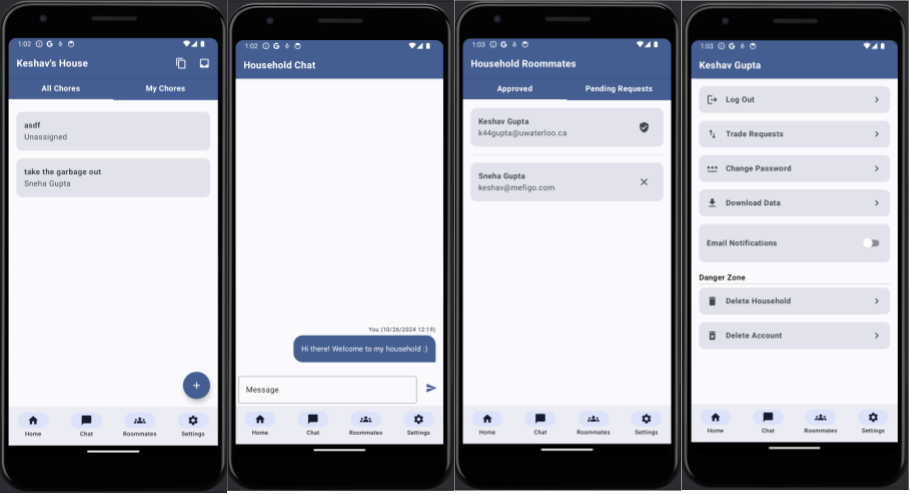

# CS346 Project

## App Information

### App Title

ChoreHarmony

### App Description

ChoreHarmony is a multi-user Android application that helps university students manage the chores in their shared household. It is intended for the efficient tracking, and completion of chores in an equitable way for all roommates in a household. It is also meant to facilitate communication between household members. ChoreHarmony helps us live together harmoniously!

### User Documentation

The user documentation is available on the [wiki](https://git.uwaterloo.ca/k44gupta/team-101-7/-/wikis/User-Documentation).

### Design Diagrams

The final design diagrams are available on the [wiki](https://git.uwaterloo.ca/k44gupta/team-101-7/-/wikis/Design-Document).

### Images

## Team Information

### Team Number

We are team number/group number **7** on LEARN in the morning section (**SEC 101**) of CS346.

### Team Members

| Name               | Quest ID | Email                 |
| ------------------ | -------- | --------------------- |
| Keshav Gupta       | k44gupta | k44gupta@uwaterloo.ca |
| Chirayu Shekkar    | cshekkar | cshekkar@uwaterloo.ca |
| Minxuan Li (Jason) | m36li    | m36li@uwaterloo.ca    |
| Orhan Benli        | obenli   | obenli@uwaterloo.ca   |

### Team Contract

The team contract is available on the [wiki](https://git.uwaterloo.ca/k44gupta/team-101-7/-/wikis/Team-Contract).

### Team Meeting Minutes

The meeting minutes can be found on the [wiki](https://git.uwaterloo.ca/k44gupta/team-101-7/-/wikis/Meeting-Minutes).

### Team/Project Reflection

The project reflections can be found on the [wiki](https://git.uwaterloo.ca/k44gupta/team-101-7/-/wikis/Team-reflection).

## Project Information

| Title | Link |
| ----| ----|
| Project propoal | [Wiki](https://git.uwaterloo.ca/k44gupta/team-101-7/-/wikis/Project-Proposal)|
| Design propoal | [Wiki](https://git.uwaterloo.ca/k44gupta/team-101-7/-/wikis/Design-Proposal)|
| Design Document | [Wiki](https://git.uwaterloo.ca/k44gupta/team-101-7/-/wikis/Design-Document)|
| Team Reflection | [Wiki](https://git.uwaterloo.ca/k44gupta/team-101-7/-/wikis/Team-Reflection)|

## Releases

| Name             | Link                                                                          | Release                                                                                      |
| ---------------- | ----------------------------------------------------------------------------- | -------------------------------------------------------------------------------------------- |
| Sprint 1 Release | [Wiki](https://git.uwaterloo.ca/k44gupta/team-101-7/-/wikis/Sprint-1-Release) | [Deployed Release](https://git.uwaterloo.ca/k44gupta/team-101-7/-/releases/Sprint-1-Release) |
| Sprint 2 Release | [Wiki](https://git.uwaterloo.ca/k44gupta/team-101-7/-/wikis/Sprint-2-Release) | [Deployed Release](https://git.uwaterloo.ca/k44gupta/team-101-7/-/releases/Sprint-2-Release) |
| Sprint 3 Release | [Wiki](https://git.uwaterloo.ca/k44gupta/team-101-7/-/wikis/Sprint-3-Release) | [Deployed Release](https://git.uwaterloo.ca/k44gupta/team-101-7/-/releases/Sprint-3-Release) |
| Sprint 4 Release | [Wiki](https://git.uwaterloo.ca/k44gupta/team-101-7/-/wikis/Sprint-4-Release) | [Deployed Release](https://git.uwaterloo.ca/k44gupta/team-101-7/-/releases/Sprint-4-Release) |
